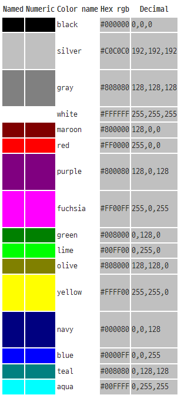

# HTML 소개
## HTML5 태그 기본 개념
##### HTML은 HyperText Markup Language의 약어로, 웹 페이지의 구조와 콘텐츠를 정의하기 위해 사용되는 마크업 언어이다. HTML은 웹 브라우저에게 문서를 표시하는 방법을 알려주는 역할을 한다.

* **WWW(World Wide Web)**
  * 인터넷에 연결된 개별 컴퓨터들을 통해 쌍방 간에 정보를 공유할 수 있는 전 세계적인 정보공간을 의미

* **하이퍼텍스트(Hyper Text)**
  * 하이퍼링크(참조)를 통해 독자가 한 문서에서 다른 문서로 즉 시 접근할 수 있는 텍스트 형태를 말한다.

* **마크업(Markup)**
  * 마크업이라는 표현은 출판업자들이 원고에 교정기호를 써넣는 것을 mark up이라 부른 것에서 나온 용어이다.

* **마크업 언어(Markup Language)**
  * 태그 등을 이용해서 문서의 논리구조 작성, 문서 서식 지 정 등의 문서처리를 지원하기 위해 문서에 추가되는 마크업을 표현하는 언어이다.

* **HTML**
  *  Hyper Text Markup Language(하이퍼텍스트 마크업 언어) 웹 사이트를 만들기 위해 사용하는 프로그래밍 언어 중 하나

* **HTML의 역할**
  * 텍스트와 이미지처럼 웹사이트에서 ‘정보’라고 불리는 요소를 입력 메뉴,배너, 본문 등 다양한 콘텐츠가 들어가는 공간을 미리 설정

## HTML의 역사
##### HTML은 웹의 창시자인 팀 버너스리에 의해 탄생되었다. 1980년에 CERN(유럽입자물리 연구소)의 직원이었던 물리학자 ‘팀 버너스 리’는 HTML의 원형인 ‘인콰이어(Enquire)’를 제안했다. 인 콰이어는 CERN의 연구원들이 문서를 이용하고 공유하기 위한 첫 번째 하이퍼텍스트 시스템이었다. 
* 1993년 미국 일리노이 공과대학교 연구기관 NCSA: 최초의 그래픽 유저 인터페이스 웹 브라우저 ‘모자이크’를 발표
* 모자이크의 핵심 개발자인 마크 안데르센: 넷스케이프 커뮤니케이션 설립 / 넷스케이프 내비게이터 발표
* 이 시기 마이크로소프트가 인터넷 익스플로러 발표
* 마이크로소프트는 인터넷 익스플로러를 윈도 운영체제에 강제로 설치함. 또한 애플과 계약을 통해 5년간 매킨토시의 기본 브라우저를 인터넷 익스플로러로 설정
* 넷스케이프는 마이크로소프트에게 소송을 걸지만 판결이 계속 미루어짐
* 넷스케이프는 극단의 조치로 웹 브라우저의 소스 코드를 공개하고 모질라 재단을 설립 / 그러나 승패는 이미 결정
* 1998년 마이크로소프트는 넷스케이프의 점유율을 넘고 넷스케이프는 붕괴 

* 플러그인: 웹 브라우저와 연동되는 특정 프로그램을 사용자 PC에 추가로 설치,
웹 브라우저 기능을 확장하는 방법으로 기업이 개별적으로 제작한 어플리케이션
* 1996년부터 Future Splash Animator(현재의 어도비 플래시)를 포함,
마이크로소프트의 액티브엑스(ActiveX) 등이 대표적인 사례
* 한편 액티브엑스와 플래시를 기반으로 한 애니메이션 제작 붐
* 2010년을 전후로 마이크로소프트와 W3C가 함께한 XHTML 2.0 표준이 붕괴
인터넷 익스플로러의 기능 문제가 대두: 최신 표준 지원 불가 문제
한마디로 지금까지의 웹 브라우저 점유율을 뒤집을 수 있는 기회가 만들어짐

##### 모든 웹 브라우저 회사가 기술적으로 다른 웹 브라우저를 앞서려고 빠른 속도로 업데이트하고 있음 하지만 기술적인 부분 이외에도 다양한 방법으로 웹 브라우저를 마케팅을 하는 중
##### 제2차 웹 브라우저 전쟁은 `2019년을 기준으로 거의 구글 크롬의 승리`로 정리되는 중

## 웹의 역사 및 인터넷의 시작
-  인터넷: 미국 국방성에서 시작.
-  소련 인공위성의 발사에서 위협을 느껴 ARPA (Advanced Research Projects Agency)부서 창설
-  1969년 ARPA는 1969년 현재 웹의 모태가 되는 ARPANET을 개발
-  1989년 팀 버너스리가 인터넷 공간 안에서 문서가 서로 이동할 수 있는 새로운 개념의 방법을 제안: 하이퍼 링크(Hyper Link)
-  이 아이디어를 바탕으로 월드 와이드 웹(World Wide Web) 개발해 1991년 처음 배포 / 1993년에 소스 코드 공개

##### 2016년 1월, 마이크로소프트는 결국 “인터넷 익스플로러 10 이하의 버전 지원을 중단한다”라고 결정.
##### 자동 업데이트를 통해 인터넷 익스플로러를 11 버전으로 강제 업데이트 그리고 그 결과 `HTML5를 본격적으로 사용할 수 있는 환경이 구축됨`

---
## CSS Color keywords

##### CSS color keywords는 웹 개발에서 사용되는 색상을 지정하는 데에 편리한 방법이다. 이 키워드는 사전에 정의된 색상 값으로, 해당 키워드를 사용하여 요소의 배경색, 텍스트 색상 등을 설정할 수 있다.

CSS는 기본적으로 RGB (Red, Green, Blue) 색상 모델을 사용한다. 이 모델에서 각 색상은 0부터 255까지의 값으로 표현된다. 그러나 이러한 숫자로 색상을 기억하고 식별하기는 어려울 수 있다. CSS color keywords는 이러한 문제를 해결하기 위해 색상 이름을 사용하여 색상을 지정할 수 있도록 제공됩니다.

예를 들어, "red"라는 키워드를 사용하면 요소의 색상을 빨간색으로 지정할 수 있습니다. 다른 일반적인 CSS color keywords로는 "blue", "green", "yellow", "black", "white" 등이 있습니다. 이러한 키워드를 사용하면 개발자는 RGB 값이나 Hex 코드와 같은 세부 정보를 기억할 필요 없이 색상을 지정할 수 있습니다.

##### CSS3에서 제공하는 색상은 `17개`의 **Basic Colors**와 `130개`의 **Extends Colors**로 **총 147개**를 제공한다.
---
## [CSS3에서 제공하는 Color keywords List](https://www.w3.org/wiki/CSS/Properties/color/keywords)
##### Basic Colors

##### 모든 색상 list

-   aliceblue
-   antiquewhite
-   aqua
-   aquamarine
-   azure
-   beige
-   bisque
-   black
-   blanchedalmond
-   blue
-   blueviolet
-   brown
-   burlywood
-   cadetblue
-   chartreuse
-   chocolate
-   coral
-   cornflowerblue
-   cornsilk
-   crimson
-   cyan
-   darkblue
-   darkcyan
-   darkgoldenrod
-   darkgray
-   darkgreen
-   darkgrey
-   darkkhaki
-   darkmagenta
-   darkolivegreen
-   darkorange
-   darkorchid
-   darkred
-   darksalmon
-   darkseagreen
-   darkslateblue
-   darkslategray
-   darkslategrey
-   darkturquoise
-   darkviolet
-   deeppink
-   deepskyblue
-   dimgray
-   dimgrey
-   dodgerblue
-   firebrick
-   floralwhite
-   forestgreen
-   fuchsia
-   gainsboro
-   ghostwhite
-   gold
-   goldenrod
-   gray
-   green
-   greenyellow
-   grey
-   honeydew
-   hotpink
-   indianred
-   indigo
-   ivory
-   khaki
-   lavender
-   lavenderblush
-   lawngreen
-   lemonchiffon
-   lightblue
-   lightcoral
-   lightcyan
-   lightgoldenrodyellow
-   lightgray
-   lightgreen
-   lightgrey
-   lightpink
-   lightsalmon
-   lightseagreen
-   lightskyblue
-   lightslategray
-   lightslategrey
-   lightsteelblue
-   lightyellow
-   lime
-   limegreen
-   linen
-   magenta
-   maroon
-   mediumaquamarine
-   mediumblue
-   mediumorchid
-   mediumpurple
-   mediumseagreen
-   mediumslateblue
-   mediumspringgreen
-   mediumturquoise
-   mediumvioletred
-   midnightblue
-   mintcream
-   mistyrose
-   moccasin
-   navajowhite
-   navy
-   oldlace
-   olive
-   olivedrab
-   orange
-   orangered
-   orchid
-   palegoldenrod
-   palegreen
-   paleturquoise
-   palevioletred
-   papayawhip
-   peachpuff
-   peru
-   pink
-   plum
-   powderblue
-   purple
-   red
-   rosybrown
-   royalblue
-   saddlebrown
-   salmon
-   sandybrown
-   seagreen
-   seashell
-   sienna
-   silver
-   skyblue
-   slateblue
-   slategray
-   slategrey
-   snow
-   springgreen
-   steelblue
-   tan
-   teal
-   thistle
-   tomato
-   turquoise
-   violet
-   wheat
-   white
-   whitesmoke
-   yellow
-   yellowgreen
